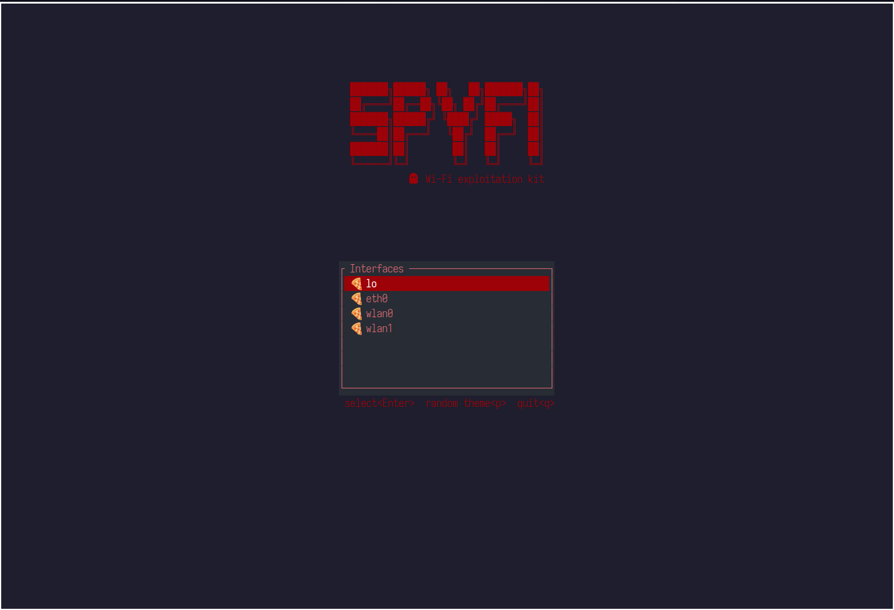

# SpyFi :satellite: - An opensource WiFi exploitation tool written in rust.


## Operation Modes
Spyfi has two operation modes:
- CLI
- TUI


***TUI mode would launch when no arguments are given.***


### **TUI**
The TUI mode provides an intuitive, informative UI
from which you can monitor and attack nearby networks.



### **CLI**

```
Usage: spyfi <COMMAND>

Commands:
  utility
  enum
  attack
  help     Print this message or the help of the given subcommand(s)

Options:
  -h, --help     Print help
  -V, --version  Print version
```

#### utility mode

commands: 
- switch between managed/monitor mode.
- change the iface channel.
- generate psk.

```
Usage: spyfi utility [OPTIONS] [MODE]

Arguments:
  [MODE]  set the interface mode [possible values: managed, monitor]

Options:
  -i, --iface <IFACE>      name of the wlan interface
      --psk <PASSPHRASE>   generate psk
  -s, --ssid <SSID>        ssid
  -l, --list               list available interfaces
  -c, --channel <CHANNEL>  set capturing channel
      --ch
  -h, --help               Print help (see more with '--help')
```

#### enum mode

captures information about nearby networks

```
Usage: spyfi enum [OPTIONS] --iface <IFACE>

Options:
  -i, --iface <IFACE>            name of the wlan interface
  -t, --timeout <TIMEOUT>        timeout in seconds [default: 60]
  -o, --outputfile <OUTPUTFILE>  dump results into an outputfile
  -s, --sweep                    use channel sweeping
  -h, --help                     Print help
```

#### attack mode

performs dictionary attack on a network from a given pcap
file

```
Usage: spyfi attack [OPTIONS] --type <ATTACKTYPE> --bssid <BSSID> <--iface <IFACE>|--capture <CAPTURE>>

Options:
  -a, --type <ATTACKTYPE>    attack type [possible values: dict, dos]
  -i, --iface <IFACE>        interface
  -c, --capture <CAPTURE>    capture file
  -t, --threads <THREADS>    number of threads to use for dictionary/bruteforce attack [default: 1]
      --target <TARGET>      target MAC for DoS attack [default: broadcast]
  -s, --ssid <SSID>          network's SSID. Might be used instead of BSSID and we will try to get it (Unrecommended)
  -b, --bssid <BSSID>        network's BSSID
      --sweep                use channel sweeping
      --wordlist <WORDLIST>  wordlist
  -h, --help                 Print help (see more with '--help')
```
